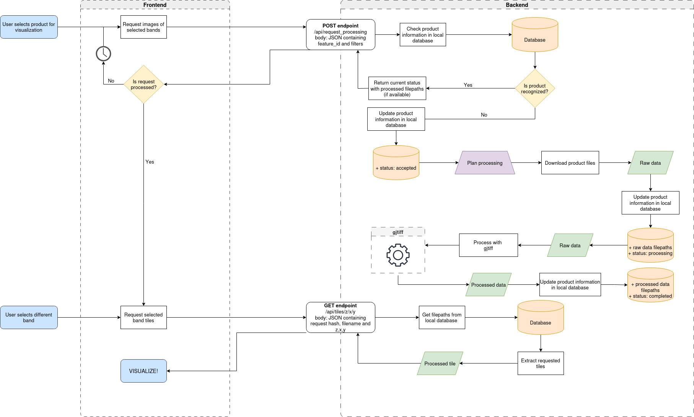

# Oculus - Current State Documentation

**Project goal:** provide an easy-to-use system for searching, processing and visualizing Sentinel-1 and Sentinel-2 (and possibly more platforms) satellite data. The platform lets end users select areas and time ranges, apply mission-specific filters, and quickly view processed imagery in a web browser without knowledge of APIs or GIS tools.

---

# System overview

The system consists of two main parts:

- **Frontend** - interactive web application (JavaScript/HTML/CSS) for area/time selection, filtering and final visualization.
- **Backend** - FastAPI Python server (Uvicorn) that handles metadata search, file download, GPU-accelerated image processing and serving of visualization results.

Design principles:
- **Modular** - separate connectors, processors and UI modules so new missions or data sources can be added with minimal changes.
- **Asynchronous** - background task handling and Celery-based workers allow concurrent processing and better responsiveness.
- **GPU-accelerated processing** - heavy raster processing is executed on NVIDIA CUDA GPUs to minimize latency for preview generation.
- **Containerized** - full stack runs in Docker for reproducible deployments.

## Core workflow

## Architecture

Repository & demo:
- Code: [`https://github.com/CESNET/dhr-visualizer`](https://github.com/CESNET/dhr-visualizer)
- Live instance: [`https://oculus.cesnet.cz/`](https://oculus.cesnet.cz/)

---

# Frontend

The frontend is a JavaScript single-page web application for visualization of satellite products.

## Tech stack
- **Leaflet.js** - interactive map, drawing tools, overlays and user interactions.
- **Vanilla JS / Fetch API** - communication with backend.
- **HTML/CSS** - layout, forms and controls.

## UX flow & controls
1. **Map initialization**
   - Loads a Leaflet map (OpenStreetMap tiles by default).
   - Initializes a bounding box overlay representing the default area of interest.
   - The bounding box and NW/SE coordinates are pre-filled and editable.

2. **Time selection**
   - Default time window is the last 7 days (UTC).
   - User can set arbitrary UTC time ranges (input fields guarantee UTC handling).

3. **Area selection**
   - User can drag/zoom the map and update the bounding box with a single button.
   - Coordinates can also be typed manually into fields (north-west & south-east).

4. **Platform selection & filters**
   - Mission choices: **Sentinel-1**, **Sentinel-2** (architecture supports adding more).
   - Mission-specific filters are available (examples):
     - Sentinel-1: product level (GRD / SLC), polarization, instrument mode.
     - Sentinel-2: processing level (L1C / L2A), cloud cover, resolution.
   - Filters are translated into OData queries to the CDSE metadata catalogue.

5. **Product listing**
   - Filtered products are loaded from the CDSE (Copernicus Dataspace) OData API and presented in a `<select>` list.
   - Selecting a product draws the product footprint polygon on the map.

6. **Requesting visualization**
   - When user clicks **Visualize selected feature**, frontend sends a request with the product ID to `/api/request_visualization`.
   - Backend queues the request and returns a task identifier.
   - Once processing completes, frontend displays the visualization result as a map overlay.

## Visualization & overlays
- Generated images are returned as JPEG previews and as tiled overlays (WebMercator) so they can be added as map layers.
- Overlay opacity is adjustable for quick comparison with base maps.
- Tiling enables efficient display of large products in the browser.
- Processed images of the entire scene can be downloaded using dedicated button in the GUI

---

# Backend

The backend is a Python service built with FastAPI and designed to process satellite products into quick visual previews and tiled overlays.

## Components
- **FastAPI app** (API surface for the frontend).
- **Background tasks / Celery workers** - asynchronous processing, task queueing.
- **MongoDB** - persistence of task metadata and statuses (accepted / processing / success / failed).
- **Redis** - Celery broker / cache.
- **gjtiff** - the core GPU-accelerated processing tool.

## API endpoints
- `POST /api/request_processing` - queue visualization request for a product, get status.
- `GET /api/get_tile/{z}/{x}/{x}` - retrieve WebMercator tile
- `GET /api/download_image/{request_hash}/{filename}` - download entire processed product image file.

## Workflow
1. **Enqueue** - frontend posts a visualization request containing product ID + parameters.
2. **Data lookup** - backend queries data source for the product metadata and data download paths.
3. **Download** - product files are downloaded to a temporary local folder.
4. **Processing** - `gjtiff` is executed to decode, equalize, rotate, downscale and compress the product into an 8-bit JPEG suitable for quick preview and tiling.
5. **Tile generation** - JPEG preview is converted to map tiles (WebMercator) for overlay.
6. **Persist** - resulting paths are stored in MongoDB.
7. **Serve** - processed visualization images / tiles are served to users.

---

# Image processing (gjtiff)

The CESNET `gjtiff` tool is the core GPU-accelerated image converter used to transform a wide variety of satellite product encodings into 8-bit JPEG previews and tile-ready rasters.

## Libraries & hardware
- **CUDA** for GPU compute.
- **GPUJPEG** for high-speed JPEG compression on GPU.
- **nvTIFF** for TIFF decoding.
- **nvJPEG2000** for JPEG2000 decoding.
- **nvCOMP** for DEFLATE decompression used in some GRD products.

# TODO Multimedia

---

# Georeferencing & alignment

Some Sentinel-1 GeoTIFFs have misalignments when overlayed on WebMercator base maps. Misalignments are most visible in areas with strong topography (mountain lakes, ridgelines). GDAL-based repositioning and reprojection is applied to processed rasters to improve alignment. Using of DEM data will be examined.

Sentinel-2 products get specific coordinate handling which gives proper alignment with the base map.

---

# Future work / plan

- **Band math & index support** (NDVI, NDSI, custom expressions) - partial support in `gjtiff`, full integration into UI planned.
- **Additional connectors** - CollGS, national relays...
- **More data sources** - Sentinel-5P, Landsat
- **Improved caching & download persistence** - reduce repeated downloads for the same product.
- **DEM-aware reprojection** - better alignment in mountainous areas.
- **Faster full-product processing** - research streaming/tiling pipelines to avoid whole-product memory footprints.
- **User features** - user sessions, saved queries, export of tiles and STAC items.
- **Black borders** - examine possible approaches to remove black border in output tiles.
