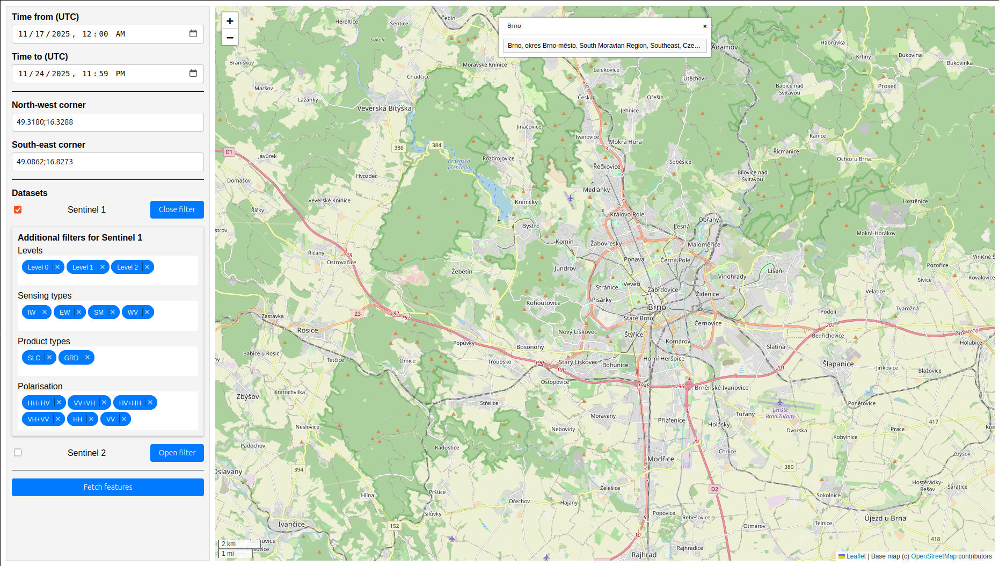
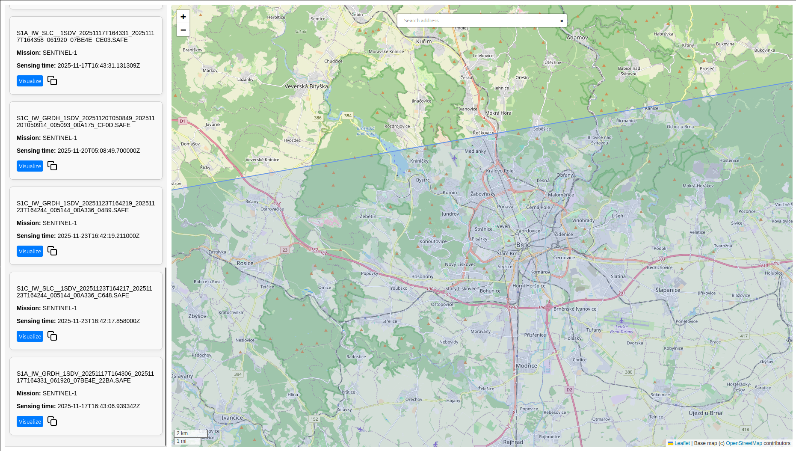
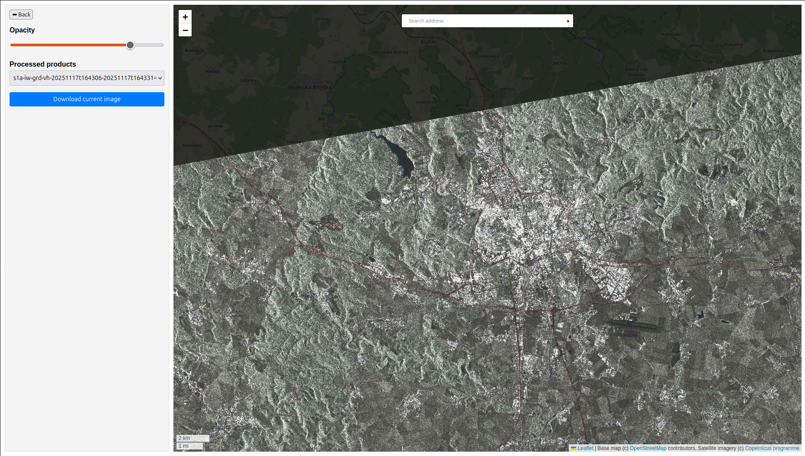

# Oculus - User Documentation

**Project goal:** provide an easy-to-use system for searching, processing and visualizing Sentinel-1 and Sentinel-2 (and possibly more platforms) satellite data. The platform lets end users select areas and time ranges, apply mission-specific filters, and quickly view processed imagery in a web browser without knowledge of APIs or GIS tools.

Oculus is a web‑based tool that lets you search for Sentinel‑1 and Sentinel‑2 satellite products, apply filters, and view a visual preview directly in the browser. All heavy processing happens on the server, so you only need a modern web browser. 

---

## 3‑Step Quick Guide 

### Step 1: Select Dataset, Area and Time Range

* Set the time window (optional) in the Time from
and Time to fields.
* Enter the area of interest in the search box or input the coordinates as a bbox in the North-west and Southeast-east 
corner fields. Otherwise, the currently viewed area will be used.
* Select Datasets from the dropdown menu.
* Specify additional filters (optional) such as cloud coverage, polarization, or orbit direction.
* Click on the Fetch features button to start searching for products.

### Step 2: Select product

* Each product's area is highlighted in the map when hovered over its information card.
* You can copy the link to the product's information by clicking the files icon next to the Visualize button.
* Select product which you want to visualize by clicking the Visualize button.

### Step 3: Visualize

* The product will be displayed in the map.
* You can use the Opacity slider to adjust the opacity of the product over the base map.
* The Processed products dropdown list shows all the files that have been processed.
* You can download the product by clicking the Download button.
